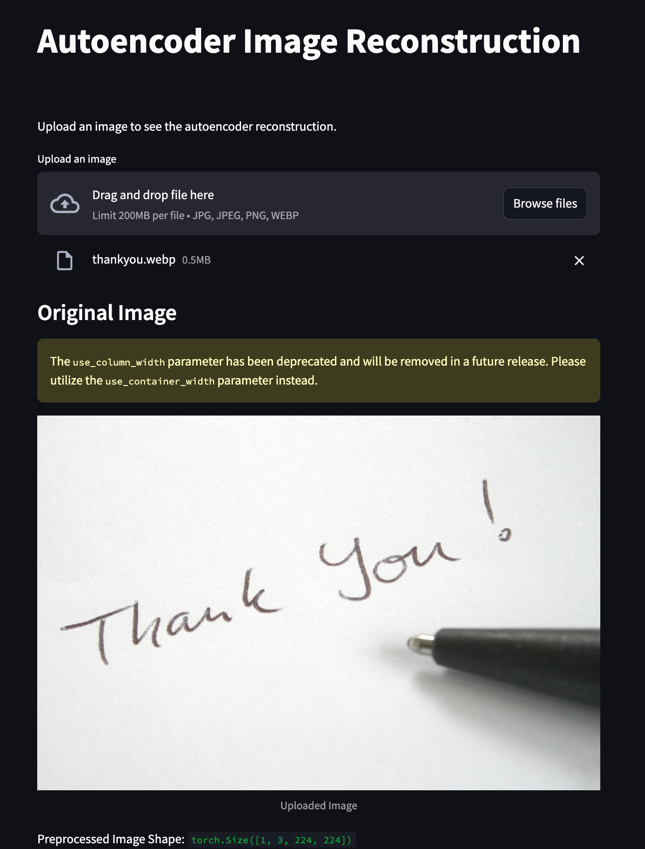
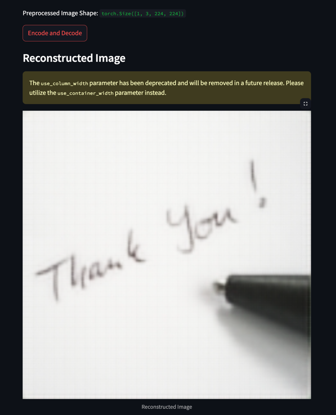

### Autoencoder Image Reconstruction

Little model trained on caltech-101 dataset with 101 classes with simple cnn architecture.
Trained on 50 epochs with 16 batch size. It can be trained further with following the steps:
1. First download dataset with make command
2. Run tools/generate_dataset.py to generate dataset providing dataset path and name
3. Finally run models/train.py providing generated train list path, model save folder, epochs, batch size, learning rate and other arguments

Run this command to reconstruct image in streamlit ui
```bash
streamlit run main.py
```



